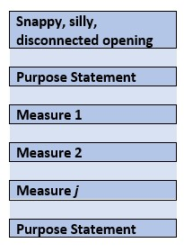
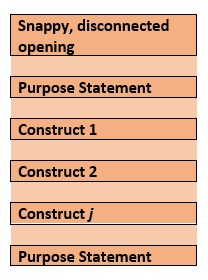
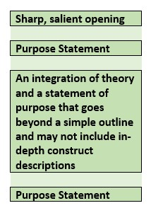

# WRITING EMPIRICAL MANUSCRIPTS {-}

# The APA Style Manuscript {#APAstyle}

<center>
*Lynette H. Bikos (she/her) & Kiana Clay (she/her)*\
*Seattle Pacific University*\
*Seattle Pacific University was built on the unceded ancestral lands of the Duwamish people*\
Chapter Status:  In Progress/Placeholder
</center>
<br>
 
```{r  include=FALSE}
knitr::opts_chunk$set(echo = TRUE)
knitr::opts_chunk$set(comment = NA) #keeps out the hashtags in the knits
```

This is sample text as we learn how to use the Github.
Ridiculous sentence on line 14. Another ridiculous line to volley it back.

```{r include=FALSE}
options(scipen=999)#eliminates scientific notation
```

This lesson focuses on APA style. While a significant portion of the material focuses on the mechanics of APA style, I also consider:

* APA style as epistemology – and its relationship with power, privilege, and racism.
*	JARS:  Journal Article Reporting Standards
  - Section by section
  - Consideration of writing as a developmental process that occurs throughout grad school and into the profession
*	Stylistic issues
  - Hallmarks of APA style
*	Reducing bias
 

## Navigating this Lesson

There is about 1 hour and 45 minutes of lecture.  

The R markdown file used to create this lecture as well as all of the figures are available at the [OER's GitHub site](https://github.com/lhbikos/ReC_Topics).

### Learning Objectives

Learning objectives from this lecture include the following:

*	Identify the cultural characteristics of APA style. 
*	Identify two ways that Thompson (2004) has suggested that APA style perpetuates Whiteness and patriarchy in the academy. 
*	List the components of an abstract. 
*	Describe why JARS matters. 
*	Begin memorizing the minutia of APA Style for writing empirical manuscripts/journal articles (no particular order). 


### Readings & Resources

In preparing this chapter, I drew heavily from the following resource(s). Other resources are cited (when possible, linked) in the text with complete citations in the reference list.

* American Psychological Association. (2020). *Publication manual of the American Psychological Association: The official guide to APA style. (Seventh edition.).* American Psychological Association.
  - I’m guessing you’ll use this more days than not, for the rest of your education.
* Tran, A. G. T. T., & Lee, R. M. (2014). You speak English well! Asian Americans’ reactions to an exceptionalizing stereotype. *Journal of Counseling Psychology, 61*(3), 484–490. https://doi.org/10.1037/cou0000034
  -  I use this article in several analyses in the ANOVA series as well as in this lesson when I compare/contrast it to the requirements of APA Style.  This article was pubbed in 2014; but I will compare it to the 7th edition (2019) standards.
* Cooper, H. (2020). *Reporting quantitative research in psychology: How to meet APA style journal article reporting standards (Second edition, revised.).* American Psychological Association. https://alliance-primo.hosted.exlibrisgroup.com/permalink/f/rpqmv/CP71332049420001451
  - The e-text version of this may be available at your library. This resource offers section-by-section instruction of the reporting standards and provides numerous examples of writing APA empirical manuscripts.
* Madigan, R., Johnson, S., & Linton, P. (1995). The language of psychology: APA style as epistemology. American Psychologist, 50(6), 428–436. https://doi.org/10.1037/0003-066X.50.6.428  
  - Madigan et al. (1995) argued that as we learn APA style we are inculcating the professional values of our discipline (and we do this without awareness).
*  Thompson, A. (2004). Gentlemanly Orthodoxy: Critical Race Feminism, Whiteness Theory, and the APA Manual. *Educational Theory, 54*(1), 27–57. https://doi.org/10.1111/j.0013-2004.2004.00002.x
  - Critiquing the 5th edition of the style manual (we’re now on the 7th) Thompson (2004) pointed out how aspects of APA style contribute to preserving Whiteness.
* Appelbaum, M., Cooper, H., Kline, R. B., Mayo-Wilson, E., Nezu, A. M., & Rao, S. M. (2018). Journal article reporting standards for quantitative research in psychology: The APA Publications and Communications Board task force report. *American Psychologist, 73*(1), 3–25. https://doi.org/10.1037/amp0000191
  - Yet another copy of the most current JARS.  You can also find them in the style manual and on their own website:  https://apastyle.apa.org/jars/glossary 
* *White Supremacy Culture.* (n.d.). DRworksBook. Retrieved August 8, 2020, from https://www.dismantlingracism.org/white-supremacy-culture.html
  - Identifies characteristics of White Supremacy Culture in organizations (often used to describe academia).
  

## APA Style as Epistemology (or Worse)

A 1995 article [@madigan_language_1995] in the American Psychologist compared APA style to that of other disciplines (history, literary criticism) and argued that APA Style is its own writing genre characterized by (among other things):

*	A story schema:  introduction, method, results, discussion
  –	Seems so linear; but this is rarely the case (research is messy). This schema serves as an implicit formula for addressing psychological questions:
  1) Review of past empirical studies
  2) Collection and analysis of new data
  3) Relation of conclusions to current psychological theories
*	A depersonalized language of disagreement that focuses on the empirical process and away from investigators as individuals (e.g., “The primary criticism is that the threshold-setting procedures used in previous experiments are not adequate to ensure that…”). The goal is a collaborative, cumulative endeavor based on research data that avoids animosity and confrontation.
*	Hedged conclusions: balancing a need to have substantive conclusions that do not extend beyond the data. We use the words, “tend,” “suggest,” and “may” (see Table 1) to allow authors to relate findings, while still recognizing the need for additional research before asserting firm conclusions. **NOTE: INCLUDE TABLE 1!!!
*	A system of headings/subheadings (rather than narrative transitions)
*	Paraphrasing rather than directly quoting other works.
  –	Giving authors more flexibility in representing others’ perspectives.
*	Multiple authors (perhaps contributing to “more subdued prose”).
*	Heavy use of citations in the introduction and discussion sections so that the research is placed within an ongoing stream of empirical studies. The use of in-text references provides vital background for the study and helps the author establish credibility as an expert on the subject they are researching.
*	Language that “does not call attention to itself.” It can be described as: self-effacing and low-profile. Colorful language and attention-grabbing metaphors are rarely used; the focus is meant to be on the phenomena being studied.

The style manual has grown from its 7-page writers guide in the Psychological Bulletin (1929) to 427 in the 7th edition (2019), today.  Madigan et al. [-@madigan_language_1995] suggests that the process of mastering APA style, one is enculturated into psychology. That is, we learn APA style – we inculcate empiricist values (i.e., “unarticulated practices that reflect fundamental attitudes and values of psychologists” (p. 428).  As such, APA style is epistemological.

Nearly a decade later, Thompson [-@thompson_gentlemanly_2004] examined APA style through the lens of critical race feminism and Whiteness Theory. Thompson argued that the expectations regarding clarity precision, appropriateness, sensitivity, and objectivity likely contribute to the academy’s investments in Whiteness and patriarchy.  While her focus was on APA Style, she suspected that her critique would generalize to other style guides (e.g., Chicago, MLA).

Thompson’s [-@thompson_gentlemanly_2004] article focused around the gender/sexuality and race values codified by the APA manual (at the time of her article it was the 5th edition).  She conducted an analysis of its *power and property investments* and organized her arguments in five themes:

**Property Rights**:  PWIs have treated refereed scholarship (but not indigenous or community knowledge) as intellectual property, demarcated with a certain class.  That is, individuals “own knowledge.” Evidence includes:

* Using last names as a shorthand reference for work (e.g., "Dik & Duffy’s 2012 CVQ").
* Tendency to cite own work rather than say, “When I previously said…”
* The style manual indicates that principal authorship and order of authorship credit should reflect the relative contributions of persons involved (7th ed, APA 1.22)  and that relative status should not determine authorship order.  Thompson argued that power dynamics (especially around race and gender) likely interfere with this principle.
*	The 7th edition has reduced citations of articles with three and more articles to “First author et al., YEAR” for all citations.  
*	Regarding, ownership of knowledge – does it belong to the researcher or the community from which it came? Community knowledge can be studied but not cited.  And what about institutions?  What if knowledge came from the Black Church?  How does one cite that?

**Precedent and pedigree**:  In the social sciences, we are expected to cite and give credit to relevant earlier works.  Knowledge is seen as cumulative. Citations are essential.

* No “unhedged statement” (p. 45) is made without a citation; and in introductory sections, citations are often included with claims that seem obvious!  This establishes the requisite lineage.
* Self-citations, expected citations (of the gurus), citations of colleagues exist IN TENSION with a citation economy (page limits, after all).
* The requirement that scholars locate their project in the context of the existing peer-reviewed literature serves to keep out ideas/projects that would be challenging to the existing power structure.

**Proceduralism**:  APA authors learn to address an audience unmarked (as if they were white, male, heterosexual) by gender or race as a “sign of professionalism” (p. 48).

* Standardized Format:  a four section structure:  Introduction, Method, Results Discussion; it could be that the experiences of marginalized and oppressed groups cannot be captured by this scientific narrative structure.
* Standardized Style:  prizing scientific appearance and elegance.  Thompson (2004) follows the guidelines regarding the use of the “slash” (/) and how it is impossible to standardize to the degree that it works for all groups.
  - The “First author et al., (year)” citation contributes to both gender- and color-blindness.  On the one hand is it “fair.”  On the other hand, it obscures the person of the author.
  - APA’s prohibition against footnotes minimizes “the good stuff” (the most juicy arguments are always in the footnotes).

**Protocol**:  Propriety or protocol represents conduct that signifies one’s understanding of prevailing relations of power, authority and legitimacy.

* The style manual (7th ed, Chapter 5, e.g., 5.2) acknowledges the importance of sensitivity and the avoidance of pejoratives to reference groups of people.  Thompson indicates that this is “admirable” it fails to address unequal power relations.  Further, distinctions between what is insensitive and pejorative may be invisible to those in positions of privilege.


**The gentleman’s agreement**:  APA style is characterized “language that conveys professionalism and formality” (7th ed, 4.7, 4.8) and “differences should be presented in a professional and noncombative manner” (7th ed, 4.7).

* Thompson [-@thompson_gentlemanly_2004] is concerned that while this is offered with the hope of pluralism and the creation of safe spaces, it causes controversies to be ignored or dismissed and may bolster complicity in racism.

## As We Dive into the Specifics

Please keep the perspectives of these authors in mind.

Let’s also look at the characteristics of White Supremacy Culture in organizations [@noauthor_white_nodate].  As we tour through the components of APA style, what resonates with this list?  Refer to the .pdf handout or website for more definitions, descriptions, examples, and antidotes.

* Perfectionism
  - Perfectionistic culture
  - Worship of the written word
  - Only one right way
  - Either/or thinking
* Concentration of power
  - Power hoarding
* Paternalism
  - Defensiveness
* Right to comfort
  - Fear of open conflict
* Individualism
  - I'm the only one
* Progress is more/bigger
  - Objectivity
  - Quantity over quality
  - Sense of urgency
  

## The JARS:  The Core of APA Style

The JARS [Journal Article Reporting Standards; @appelbaum_journal_2018] were first introduced in a 2008 feature in the American Psychologist [@noauthor_reporting_2008] and were included in the 6th edition of the style manual.  The updated JARS, published in 2018, expanded the types of quantitative research (JARS-Quant) and included standards for reporting qualitative (JARS-Qual) and mixed methods (JARS-Mixed).  Chapter 3 of the 7th edition is devoted to JARS.  It contains numerous tables, definitions/explanations, and a flowchart.

The JARS are an attempt to represent what is common across approaches.  There is a recognition that specialties/sub-specialties use different terminology.  The terms, therefore, should be treated as placeholders and be updated to reflect the various research traditions.  

In each of the sections below, I list both the APA style recommendations and JARS elements – which are somewhat annoyingly separate, adjacent, and overlapping.

In the next section I used text-citations to also refer to the section numbers of the 7th edition of the APA style manual. Additionally, because this OER is publicly available (i.e., not just used in my classroom), I have not copied the JARS elements into this document. They are freely available [here](https://apastyle.apa.org/jars/quantitative).

### Title, Authorship, Author Note (APA 2.3)

***ARE WE KEEPING THE QUIZLETS? QUIZLET:
A manuscript title should

a.	Use abbreviations whenever possible
b.	Contain at least 30 words 
c.	Be fully explanatory when standing alone
d.	Begin with the words, A Study of

The title page of a manuscript includes the

a.	Author’s name
b.	Author’s institutional affiliation’
c.	Running head
d.	Short title
e.	All of the above

#### Title (APA 2.4)

*	Concise statement of main topic of the research, 
*	Identify the variables or theoretical issues under investigation (and the relationship between t Addhem), 
*	Focused and succinct (no prescribed word or character limit per the style manual; but a journal may have one).
*	Avoid empty words/phrases like “A study of,” “An investigation of”
   
*The lecture further reviews JARS elements.*

#### Authorship/Byline (APA 2.5) & Affiliation (APA 2.6)

*	Primary contributors; 
*	Institutional affiliation AT THE TIME of the study, no more than 2 institutional affiliations (and they both need to have contributed equally)
*	Very specific style guidelines (with superscript notations) for connecting authors and their affiliations
*	In the order of contribution – lots of ethical, practical, and sensitive considerations about who gets to be an author and in what order.

**Sticky Issues about Authorship**

*	Faculty as first authors
*	Ongoing projects with years of investment sponsored by faculty
*	Who gets “the call”? (is "the call": who gets to decide who is first author?)
*	Order between equal contributors (e.g., Singer & Willett)
*	In equal contributions it is okay (but not ideal) to mention in the author note
*	GOAL:  name on a project, less concerned about author order
*	Generally, graduate projects include the faculty sponsor as an author
*	Author-order [rubrics](https://github.com/lhbikos/TransformingResearchMethods/blob/main/Authorship%20Rubric220721.xlsx) can be useful to guide the decision

#### Author Note (APA 2.7)

Place the author note at the bottom half of title page.  There are more specific instructions in style manual. Generally author note has four paragraphs:

*	ORCID iDs https://orcid.org 
* Changes in affiliation subsequent to the time of the study, “[Author’s name] is now at [new affiliation].”  Can also be used if an author is deceased.
* Disclosures and acknowledgements (i.e., study registration, open practices and data sharing, related reports, conflicts of interest, financial or other assistance).
* Contact information for corresponding author. Requires full name, complete mailing address, and e-mail.  Prescribed format:  Correspondence concerning this article should be addressed to [author’s name’], [complete mailing address]. Email: author@institution.edu

*The lecture further reviews JARS elements.*

#### Running Head (APA 2.8)

*	Abbreviated title printed at the top of the pages of a ms or pubbed article to identify it for the readers
*	Max of 50 characters (counting letters, punctuation, spaces between words).  If the title is already 50 characters or fewer, the full title can be used. Avoid abbreviations in the running head, although the ampersand can be swapped (& for “and”).
*	Appears flush left in all uppercase letters at the top of the title and subsequent pages

#### Manuscript Page Headers/Page Numbers (APA 8.03)

*	Number consecutively, beginning with the title
*	Identify each page with the running head along with the page number
*	To facilitate a blinded review, do not include your name in the page header
*	Use the automatic functions of the word-processer to generate page headers and page numbers 

### Abstract (APA 2.8, 3.3)

QUIZLET:
An abstract should

a.	Appear on the same page above the title and introduction
b.	Be single-spaced and set with larger margins
c.	Begin on page 2
d.	Be no longer than 3% of the text

Abstract lengths vary from journal to journal; the typical range is from ___ to___ words. (250 to 500???)

A good abstract is:

*	Concise and specific
*	Nonevaluative
*	Coherent and readable
*	Loaded with keywords
*	May be a single paragraph (no indentation of first line) or structured (still no indentation, but labels inserted for the prescribed sections). 

#### Recipe for an Abstract

*	Identify the problem under investigation (1 sentence)
*	Identify the participants and salient characteristics 
*	Identify the experimental method, including the apparatus, data gathering procedures, complete test names, etc.
*	Identify findings (including statistical significance levels)
*	Identify conclusions and implications/applications.
*	Avoid *boilerplate* sentences.
  –	At the end of an abstract, I often read, "Findings and implications will be discussed."  This is boilerplate because "everyone says it."  It's also empty and a waste of words because it tells us NOTHING about the study.
*	The style manual includes outlines for a variety of types of manuscripts.

*The lecture further reviews JARS elements.*

#### Keywords

Keywords include single words, phrases, or acronyms that describe the most important aspects of the paper.  The purpose is indexing in databases (it’s what we search on in database like PsychInfo).  

### Introduction (APA 2.11)

QUIZLET: 
The introduction section of a research report should:

a.	Include a thorough historical review of the literature
b.	Define all of the terms that would be unintelligible to a reader with no previous exposure to the field
c.	Present the specific problem to be explored and described in the research strategy
d.	Be clearly labeled.

What question should the introduction section of a research report attempt to answer?
a.	What are the theoretical implications of the current research?
b.	What is the point of the study?
c.	What is the logical link between the problem and the research strategy?
d.	All of the above are correct.
e.	Only a and c of the above are correct.

Before you write, consider this:

*	Why is this problem important?
*	How does this study link to previous work? 
*	What are the primary/secondary hypotheses/objectives? What are their links to theory?
*	How do the hypotheses and research design relate to each other?
*	What are the theoretical and practical implications?

Three parts to the Introduction

*	Brief introduction, 1-2 paragraphs
*	Review of relevant scholarship, 1-2 pages
*	Purpose, rational, hypotheses, 1-2 paragraph’s at the section’s close.

#### The Brief Introduction

A good introduction paragraph answers the following questions in 1-2 paragraphs

*	What is the point of the study?
*	How do the hypothesis and experimental design relate to the problem?
*	What are the theoretical implications of the study and how does the study relate to previous work in the area?
*	What are the theoretical propositions tested and how were they derived?

In the middle…above ALL

*	Demonstrate that the problem is IMPORTANT
*	Narrative thread.
*	Always refer to the THEORETICAL BACKGROUND
*	Narrative thread. 
*	Closing paragraph a statement of purpose and rationale of project.
*	Narrative thread.

The closing paragraph(s) of the Introduction

*	What variables did I plan to manipulate?
*	What results did I expect and why did I expect them? (the logic of this should also be made clear)
*	What is my rationale for each hypothesis?

*The lecture further reviews JARS elements.*

#### Bikos' Developmental Perspective on Learning to Write the Empirical Manuscript

Over the years I have been learning writing skills of my own and, in my roles as instructor and peer reviewer, providing feedback to others. Below is an oversimplified model of what I think I'm observing as students and scholars learn to write empirical manuscripts (in the specific APA style).

Figure 1.  The first stage of writing.



Figure 2.  The second stage of writing.



Figure 3.  The third stage of writing.


Figure 4.  The fourth stage of writing.



#### Perennial Notes from Research-Project Faculty Graders

*	Start with your problem statement
  –	What is your DV and why does the reader care?
*	Theory must drive your model/manuscript.
  –	“A list of variables does not a theory-driven model make.”
*	Active headers are your friends
  –	Not helpful:  “Gender & RSB”
  –	More helpful:  “RSB vary across Genders”

### Method (APA 2.06; Chapter 3)

*	Describes in detail how the study was conducted.
*	Includes conceptual and operational definitions of variables.
*	How much info is enough? Readers must be able to…
  –	Evaluate the appropriateness of the method
  –	Judge the reliability and validity of your results
  –	Replicate the study

Many of the JARS elements have even more detail in the text that follows the table.  In your first few papers, make sure to review and imitate.

*The lecture further reviews JARS elements.*

Regarding these tables – flowchart and tables in style manual, Appelbaum (2018) article, or [website](https://apastyle.apa.org/jars/jars-quant-decision-flowchart.pdf).

### Results & Discussion (Chapter 3)

*The lecture references the JARS elements in detail.*

Section 6.43 of the APA style manual details the basic form for statistical output (“statistical strings”); 6.44 provides statistical abbreviations and symbols.

### Headings (APA 2.7)

The 7th edition of the style manual updated the levels of headings. The change is to the L3 heading – making it a little easier for Word processing programs.

There are now 5 levels of headings. A useful table that illustrates them can be found [here](https://apastyle.apa.org/style-grammar-guidelines/paper-format/headings).

Headings follow a top-down progression. 

*	Each section (i.e., Title [on first page], Method, Results, Discussion) starts with an L2 heading.
*	Do not include an “Introduction” heading – the first paragraphs of a paper are automatically expected to be introductory in nature.
Here’s the heading structure in the paper (a “brief report”) we are investigating:

**You Speak English Well!  Asian American’s Reactions to an Exceptionalizing Stereotype Microaggressions Against Asian Americans** (L1, centered, bold, title case)

**Method** (L1, centered, bold, title case)

**Sample** (L2, flush left, bold, title case)
**Procedure and Materials** (L2, flush left, bold, title case)
**Analysis and Manipulation Check** (L2, flush left, bold, title case)

**Results** (L1, centered, bold, title case)

**Discussion** (L1, centered, bold, title case)

**Conclusion** (L1, centered, bold, title case)

### Reference List

The reference list should start on a new page with “References” in bold and centered (an L1 heading – like the title).

The general format of the reference is:   Author (Date). Title. Source.  The 7th edition has made significant improvements in making this format consistent throughout the many types of references. Plus, Chapter 9 in the 7th edition has a number of tools for problematic reference entries.

One substantial change in the 7th edition is the immediate use of “et al.” after the first author’s name when there are three or more authors. In contrast, up to 20 authors can be included in the entry in the reference list.

Use a hanging indent and format this with the paragraph-formatting function of your word processor’s ruler. This means that the first line of each reference is flush left and subsequent lines are indented by 0.5 inches.

The text-citations and reference lists must be 100% consistent.  If you have consistently (and properly) used your reference management system, this will happen by magic.  Even so, one of the last things I do is a text-ref/ref-list cross check.  I open 2 copies of the manuscript and put them side-by-side on the monitor. Starting with the text (and in track changes), each time I come to a reference, I put an X in front of it on the reference list. I go through the entire document. If there are items in the reference list missing, I note it, and then add it. If there are additional references in the reference list that I have not checked, I do a quick search to see if they are really missing, and if so, I delete them. ****SHOULD THIS PART BE KEPT? For dissertation proposals and defenses, we ask first and second year students to do this for us – it familiarizes them with RVT topics, the dissertation process, and the literature.

Because of Zotero, Mendeley, RefWorks, EndNote, and other reference management systems (as well as the good tools in the style manual), I won’t say more about text-citations and reference lists. 

### Stylistic Issues (APA Chapter 4 on *Writing Style and Grammar*)

APA (4.0) is committed to a literary style characterized by continuity (logical consistency of expression throughout a written work), flow (smooth cadence of words and sentences), conciseness (say only what you need to say), and clarity. I encourage the authors to read Chapter 4 of the style manual for examples of how to increase the effectiveness with which they write.  

*	Transitional words between sentences and phrases (or sentences) between paragraphs and sections assist with continuity and flow
 –	Time:  then, next, after, while, since
 –	Cause-effect:  therefore, consequently, as a result
 –	Addition links:  in addition, moreover, furthermore, similarly
 –	Contrast links:  but, conversely, nevertheless, however, although
 –	Think twice about using adverbs (certainly, consequently, importantly, interestingly) as transition words.
*	Active headings/subheadings contribute to continuity and flow.
*	Don’t add any more words than necessary.  Say *only* what needs to be said:
 –	No “fluff” (avoid:  very, really)
 –	Maintain a professional tone (avoid cliché’s, rhymes, alliteration, metaphors, slang – remember a global audience)
*	Clarity is improved with a varied sentence length; long sentences can be confusing.
*	APA style permits both active (subject, verb, object: “students completed surveys) and passive (object of verb is presented first: “surveys were completed by students”) voice.  The active voice contributes to direct, clear, and concise statements.  

More style-congruent advice:
*	Avoid abstract stacking.
*	Avoid organizing by an author(s)’ name(s). 
 –	Organize by ideas – Unless it is important, citations should be at the end of a sentence.  Ask yourself why you are starting a sentence with an author’s name – Is he or she the point of your sentence?  Could be but most likely not.
*	Use quotations sparingly:  short ones, infrequently.
*	Precision, continuity, clarity, efficiency (stop with the long sentences)
*	Active voice (“It” is banned as first word in paragraphs and sentences).
*	Manuscript must be written in first person. 
 –	Avoid this: "Hypotheses for the present study included…"
 –	Do this instead:  "In our study, we hypothesized…"
*	Past tense or present perfect tense for the literature review, method, and results sections; present tense for the discussion section.

### Reducing Bias (APA Chapter 5)

Chapter 5, “Bias-Free Language Guidelines” is new to the 7th edition.  A big message is that this is-and-will-continue-to-be-evolving.

Here are some of the highlights

*	Describe relevant characteristics; it is likely unnecessary to collect and/or report on all personal characteristics for the topic being explored.
*	Do not shy away/hide/gloss over actual differences in the target population from the general population. Describe them clearly and professionally.
*	There are specific guidelines for level of specificity in labels/language for various topics (e.g., disability, age, gender identity, race/ethnicity/nationality, sexual orientation, SES).  Look them up.
*	A few guiding principles (but there are so many more…read the chapter):
 –	Call people what they call themselves (especially in qualitative or participant-informed research designs).  Also recognize that no group is monolithic so there may be within-group differences about this.
 –	Accept that language changes with time – stay open minded.
 –	There is debate about person-first language (“a child with autism”) and identity-first language (“an autistic child”). Get consultation and listen to the research participants.
 –	“White,” “cis-gendered,” “heterosexual,” and “U.S.” is often the standard against which others are judged.  This centers Whiteness.  Avoid these false hierarchies.  When these comparisons are made, placing the socially dominant group on the left side of a graph or at the top of a table may imply these groups are the universal standard.

A (very) few specific details:
*	On identification of race:
 –	“African American” is discouraged as an umbrella term for people of African ancestry worldwide because it obscures other ethnicities or national origins (e.g, Jamaica).  In these cases use Black (with a capital “B”).
 –	“Caucasian” is discouraged as an umbrella term for White or European because it originated as a way of classifying White people as a superior race.  Use White (with a capital “W”).
 –	“Native American” and “Native North American” seem to be preferred in North America.
 –	“Latin@” is now widely accepted for Latino and Latina; as is “Latino/a.” “Latinx” can also be used as a gender-neutral or nonbinary term inclusive of all genders.  
*	Avoid writing about “minorities.”  Terms like “people of color” or “underrepresented groups” are preferred.  Do not assume that members of any of these groups are “underprivileged.”  Terms like “economically marginalized” or “economically exploited” may be preferred.
*	Use “sexual orientation” not “sexual preference,” “sexual identity,” or “sexual orientation identity.”  The term “sexual and gender minorities” refers to multiple sexual and/or gender minority groups or write about “sexual orientation and gender diversity.”  
 –	LGBT is considered outdated, but LGBTQ, LGBTQ+, LGBTQIA, AND LGBTQIA+ may be used to refer to multiple groups (but be careful and specific; if you are researching transgender people…then talk about transgender people).
*	“They” is now acceptable to use in the singular.  There are a number of circumstances when this is recommended.  A few include:
 –	When it is the person’s preferred pronoun.
 –	When the pronoun is unknown.
 –	In place of “he or she,” “s/he,” and “(s)he.”  
 
### Closing Thoughts
 
1.	Fluency in APA style is a long journey.  One of my own strategies in an APA Cheat Sheet (presently 38 pages long).

  a.	I wrote it to help with reviewing/editing/grading (and also for my own writing), so I can search on words/phrases that I am likely to  say.
  b.	I can add/update it.
  c.	Each element in my cheatsheet has the section number (for papers I review as well as my own self-doubt when I wonder, later).

2.	Having now toured the 7th ed, what are your thoughts about its relation to power, privilege, racism/anti-racism, and White supremacy culture?  

Repeated are the characteristics of White supremacy culture.  I have italized those that strike me as being reflected in APA Style.

* Perfectionism
  - *Perfectionistic culture*
  - *Worship of the written word*
  - *Only one right way*
  - Either/or thinking
* Concentration of power
  - *Power hoarding*
* Paternalism
  - Defensiveness
* Right to comfort
  - *Fear of open conflict*
* Individualism
  - I'm the only one
* Progress is more/bigger
  - *Objectivity*
  - Quantity over quality
  - Sense of urgency


```{r include=FALSE}
sessionInfo()
```


