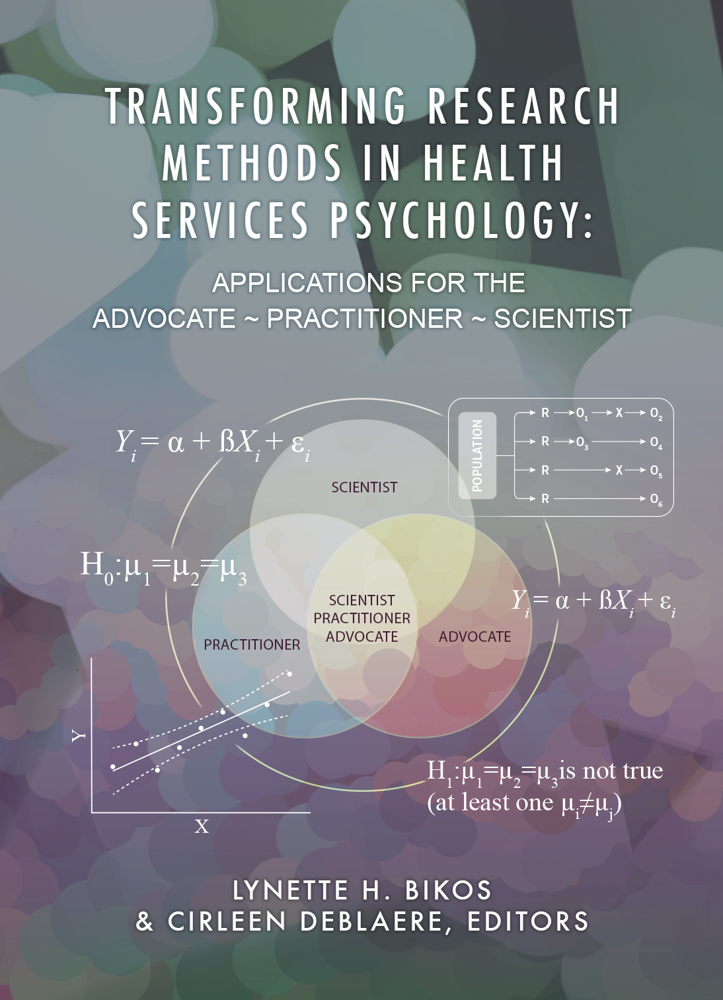

--- 
title: "Transforming Research Methods in Health Services Psychology: Applications for the Advocate ~ Practitioner ~ Scientist"
author: 
  - Lynette H. Bikos, PhD, ABPP & Cirlene DeBlaere, PhD, Editors
  - Kiana Clay, Editorial Assistant
date: "`r format (Sys.Date(), '%d %b %Y')`" 
site: bookdown::bookdown_site
documentclass: book
fontsize: 11pt
geometry: margin=1in
highlight: tango
urlcolor: blue #without this the links in the PDF do not show
citation-style: apa-single-spaced.csl #if you want APA style
bibliography: STATSnMETH.bib #This is my own bibtex file from my Zotero account. If this file is not in the project folder there will be an error and the book will not build.
link-citations: yes
#DID NOT WORK, BUT DID NOT HURT EITHER I THINK IT NEEDS TO BE CONNECTED TO A PKG
#line-wrapping-in-code: true #wrap overflowing lines in code blocks? 
url: https://lhbikos.github.io/TransformingResearchMethods/ #a link to the GitHub pages where it is rendered
cover-image: images/bookcover.png #link to the image for the book which will show up in any previews
description: |
  "Analysis of Variance" is a mini-volume in the ReCentering Psych Stats series that provides workflows and worked examples in R. A core focus of the ReCentering series is simulate data from published examples that recenter psychological research in a socially and culturally responsive manner. 
github-repo: lhbikos/ReCenterPsychStats

---

# BOOK COVER {-}

This open education resource is available in the following formats, all available in the [docs](https://github.com/lhbikos/TransformingResearchMethods/tree/main/docs) folder at the GitHub repository:

* Formatted as an [html book](https://lhbikos.github.io/TransformingResearchMethods/) via GitHub Pages available 
* As a [PDF](https://github.com/lhbikos/TransformingResearchMethods/blob/main/docs/TransformingResearchMethods.pdf) 
* As an [ebook](https://github.com/lhbikos/TransformingResearchMethods/blob/main/docs/TransformingResearchMethods.epub)
* As a [Word Document](https://github.com/lhbikos/TransformingResearchMethods/blob/main/docs/TransformingResearchMethods.docx)

All materials used in creating this OER are available at its [GitHub repo](https://github.com/lhbikos/TransformingResearchMethods).

# PREFACE {-}

**If you are viewing this document, you should know that this is a book-in-progress.  Early drafts are released for the Transforming Counseling Psychology Curriculum Showcase at APA 2022, for peer review, and for generating interest in collaboration. The document was last updated on `r format (Sys.Date(), '%d %b %Y')`**.  

In her 2021-2022 term as President of the Society of Counseling Psychology, one of Dr. Amy Reynolds' Presidential Initiatives was *Transforming Counseling Psychology Curriculum and Praxis.* Dr. Reynolds invited counseling psychology faculty, practitioners, and doctoral students "to critically examine and deconstruct how various competencies, courses, and content are taught; how we socialize our students; and then re-imagine, dream, and reconstruct new and transformative ways to teach and train."

## Strategies for a Social Responsivity {-}

This open education resource (OER) is a product of the group devoted to *research*. There are a number of strategies we used to ensure that the OER moves in the direction of being socially and culturally responsive.

* Our authors committed to using the guidelines for a liberated syllabus found in the CCTC:  Social Responsiveness in [Health Services Psychology Education & Training Toolkit](https://pr4tb8rrj317wdwt3xlafg2p-wpengine.netdna-ssl.com/wp-content/uploads/2021/05/CCTC_Socially-Responsive-HSP-Ed-Training_v7.pdf). 
* We chose the format of OER because provides a zero-cost *textbook* to faculty and students. 
* We sought authors and co-author teams that represent the diversity of health services psychology including discipline (counseling, clinical, educational),stage in career (students, early career professionals, mid- and late- career professionals), and identities that have been  marginalized in higher education and our discipline. 
* Each chapter works its way through an open peer review process where the chapter (with authors clearly identified)is hosted in a shared drive. At least two reviewers can mark up the same document and contribute to the same rubric. At any time the author(s) can see the review and, if desired, dialogue with the reviewers. At the outset, we specified the tone to be "formative not summative."
* Although we are still learning, we have attempted to use tools and techniques that are consistent with universal design. For example, we hope that the image captions and headers are marked such that text readers will identify them as such.

## Perpetually in Progress {-}

This book is being formatted in R Markdown, rendered into its "book" format with Bookdown, hosted on GitHub, and pushed to the internet (in its html format) through GitHub Pages. This set of tools allows the book to be *perpetually-in-progress.* This means that our authors can update their chapters at-any-time. It also means that we can add chapters at-any-time. If you are interested in contributing to the book, please contact us. It is one of our greatest hopes that this flexibility contributes to the socially and culturally responsive pedagogy that we intend.

## Under Construction {-}

At this stage in the OER's development, authors are still writing and revising chapters. The following designations will identify the chapters that have not been through the review process:

* *In-progress* means that the chapter is partially written (or perhaps outlined) and that the author(s) are continuing to work on the chapter.
* *Under review* means that the chapter is being (or has been) peer-reviewed. 

## Acknowledgements {-}

Financial support, supporting the copy editing and desktop publishing for this project was provided by the Office of Education, Technology, & Media, Seattle Pacific University (Summer 2022).

The book cover was designed by Dominic Williamson, Senior Instructional Designer in Graphics & Illustrations, in the Office of Education, Technology, & Media at Seattle Pacific University.

## Copyright with Open Access {-}

This book is published under a a <a rel="license" href="http://creativecommons.org/licenses/by-nc-sa/4.0/">Creative Commons Attribution-NonCommercial-ShareAlike 4.0 International License</a>. This means that this book can be reused, remixed, retained, revised and redistributed (including commercially) as long as appropriate credit is given to the authors. If you remix, or modify the original version of this open textbook, you must redistribute all versions of this open textbook under the same license - CC BY-SA.

A [GitHub open-source repository](https://github.com/lhbikos/ReC_MultivModel) contains all of the text and source code for the book, including data and images. 

